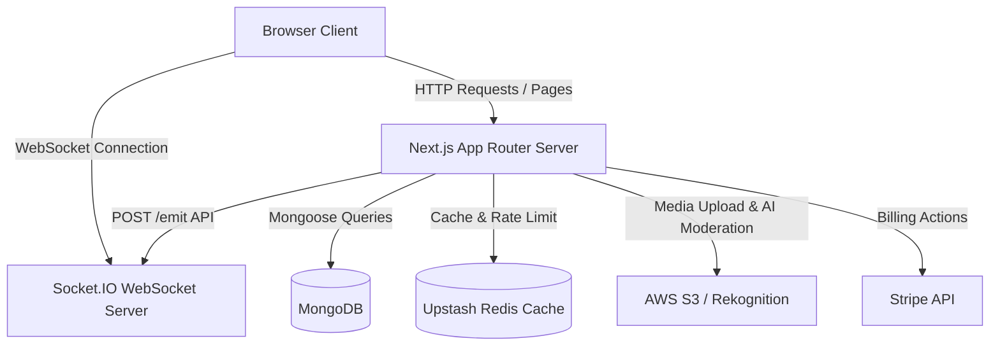

# NexSyncHub - System Architecture

This document describes the high-level architecture, directory layout, and key communication workflows of the NexSyncHub platform.

## 1. High-Level Topology

NexSyncHub is divided into two primary services:
1. **Next.js Web Application (`/nexsynchub`)**: Runs Next.js 16 (using App Router) as the web frontend, client interface, database driver (via Mongoose), task execution triggers, and SaaS payment handlers.
2. **WebSocket Server (`/socket-server`)**: A lightweight Node.js Express server running `socket.io` to manage real-time updates (chat, user typing indicators, online presence, and real-time security logging audits) independently from Next.js server-side renderings.

## 2. Directory Layout

The Next.js project is structured inside `/nexsynchub/src`:
*   `src/app/`: The page routes, layouts, and API routes. Divided into public paths `(public)`, authenticated spaces `(dashboard)`, admin settings `admin`, and the invite/OTP validation handlers.
*   `src/components/`: Reusable React components categorized by scope (e.g. `layout/` for navbar/sidebars, `global/` for elements like Cloudflare Turnstile CAPTCHA, and dashboards).
*   `src/lib/`: Unified client/server helper code, database connect hooks, Stripe SDK wrappers, Resend email drivers, AWS S3/Rekognition helper libraries, rate-limiting handlers, and permission validators.
*   `src/models/`: MongoDB database collection Mongoose schema definitions.
*   `src/providers/`: Global providers such as `SessionProvider` for Next-Auth sessions.
*   `src/proxy.ts`: Next.js middleware handling edge routing, checking Next-Auth tokens, checking global maintenance status, and enforcing page access redirects.
*   `src/types/`: Centralized TypeScript typings.
*   `src/utils/`: Lightweight utility algorithms.

## 3. Real-Time Communication Workflow

1. **Connection**: Clients connect to the WebSocket server using `socket.io-client` on port `4000` (or `process.env.NEXT_PUBLIC_SOCKET_URL`).
2. **Room Subscriptions**:
    *   Clients subscribe to channels via `join_channel` events.
    *   Clients subscribe to workspace online status updates via `join_workspace_presence` events.
    *   Administrator dashboards subscribe to security actions via `join_admin_global` events.
3. **Typing Indicators**: Active typing events trigger `typing_start` and `typing_stop` on the client, broadcasted to other channel members in real-time.
4. **Platform Event Emits**: When the Next.js API performs database modifications (like sending messages, editing tasks, or posting security logs), the Next.js server makes a POST request to `/emit` on the Socket.IO server, which then pushes the update down to the relevant WebSocket rooms immediately.
